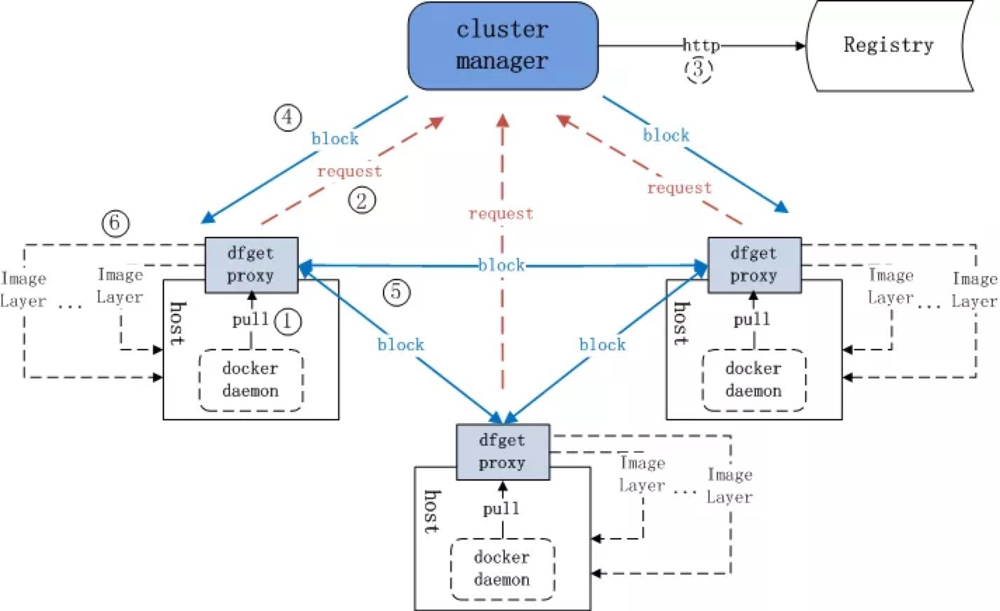

> 基于 Dragonfly [**`v0.3.0`**](https://github.com/dragonflyoss/Dragonfly/releases/tag/v0.3.0) 版本。

容器技术虽然通过镜像统一的业务的构建、分发和运行，但是当容器云平台达到一定规模之后，镜像的分发可能成为整个平台的性能瓶颈。
例如：一些对业务启动时间比较敏感的场景下，可能因为镜像太大、拉取时间过长而影响正常业务；在大规模集群下，大量节点同时拉取镜像，
会短时间给镜像仓库很大的负载压力，影响镜像仓库的稳定性和响应速度。Dragonfly 是阿里巴巴开源的基于 P2P 的镜像和文件分发系统，
能够高效地解决这些镜像分发的问题。本文将详细介绍其实现原理，以及相关实践经验。

## Overview

### Introduction

Dragonfly 是阿里巴巴开源的基于 P2P 的镜像和文件分发系统。
它主要通过最大限度地利用网络带宽，提高文件传输的速率和效率，来解决大量数据分发的问题，例如：文件分发、镜像分发等。

主要功能特性如下：

* 基于 P2P 的文件分发：通过利用 P2P 技术进行文件传输，它能最大限度地利用每个对等节点（Peer）的带宽资源，以提高下载效率，并节省大量跨机房带宽，尤其是昂贵的跨境带宽。
* 非侵入式支持所有类型的容器技术：Dragonfly 可无缝支持多种容器用于分发镜像。
* 被动式 CDN：这种 CDN 机制可防止重复远程下载。
* 高度一致性：Dragonfly 可确保所有下载的文件是一致的，即使用户不提供任何检查代码（MD5）。
* 磁盘保护和高效 IO：预检磁盘空间、延迟同步、以最佳顺序写文件分块、隔离网络-读/磁盘-写等等。
* 高性能：SuperNode 是完全闭环的，意味着它不依赖任何数据库或分布式缓存，能够以极高性能处理请求。
* 自动隔离异常：Dragonfly 会自动隔离异常节点（对等节点或 SuperNode）来提高下载稳定性。

### Architecture



Dragonfly 主要包含两个组件：

* SuperNode：Dragonfly 超级结点，有两个主要功能：
    * P2P 网络中的控制器，调度节点间的分块数据的传输路径；
    * CDN 服务器，从文件源下载并缓存文件，避免相同文件的重复下载。
* Dfclient：每个节点上的 Dragonfly 代理，包含有两个组件：
  * Dfget：Dragonfly 的客户端，负责 P2P 网络中文件的下载和传输。
  * Dfdaemon：Dragonfly 的守护进程，Docker daemon 跟 Docker registry 间的代理，劫持所有 Docker daemon 的镜像 pull 请求，然后通过 Dfget 从 SuperNode 中拉取镜像。

### Theory

通过镜像加速下载的场景，详细解析其原理：

1. dfget-proxy 拦截客户端 docker 发起的镜像下载请求（docker pull）并转换为向 SuperNode 的dfget 下载请求；
1. SuperNode 从镜像源仓库下载镜像并将镜像分割成多个 block 种子数据块；
1. dfget 下载数据块并对外共享已下载的数据块，SuperNode 记录数据块下载情况，并指引后续下载请求在结点之间以 P2P 方式进行数据块下载；
1. Dokcer daemon 的镜像 pull 机制将最终将镜像文件组成完整的镜像。

## Experiments

### Environments

* SuperNode
  * 192.168.21.103
* Clients
  * 192.168.21.102
  * 192.168.21.101

### Installation

下面以私有镜像仓库 `cargo.caicloud.io` 为例，演示安装过程。

1. SuperNode

```shell
$ docker run --name dragonfly-supernode --restart=always -d -p 8001:8001 -p 8002:8002 -v /data/dragonfly/supernode:/home/admin/supernode registry.cn-hangzhou.aliyuncs.com/dragonflyoss/supernode:0.3.0 -Dsupernode.advertiseIp=192.168.21.103
```

SuperNode 参数说明：

- **Dsupernode.advertiseIp**: SuperNode 对外暴露的 IP。如果不配置的话，默认是 `127.0.0.1`，会导致 Clients 无法连接 SuperNode。

2. Clients

* 创建 Dragonfly 配置文件

```shell
$ cat <<EOD >/etc/dragonfly.conf
[node]
address=192.168.21.103
EOD
```

* 配置 Docker daemon

将 Dfclient 添加为 Docker daemon 的 `registry-mirrors`，使 `docker pull` 的命令，能够被 Dfclient 劫持并转化为向 SuperNode 发请求。
更新 Docker daemon 配置后，需要重启 Docker 才能生效。

```shell
$ cat /etc/docker/daemon.json
{
  "storage-driver": "overlay",
  "log-driver": "json-file",
  "default-ulimit": [
    "nofile=655350"
   ],
  "log-opts": {
    "max-file": "2",
    "max-size": "64m"
    },
  "registry-mirrors": [
    "http://127.0.0.1:65001"
  ],
  "debug": false
}
$ systemctl restart docker
```

* 安装 Dfclient

```shell
$ docker run --name dragonfly-dfclient --restart=always -d -p 65001:65001 -v /root/.small-dragonfly:/root/.small-dragonfly -v /etc/dragonfly.conf:/etc/dragonfly.conf dragonflyoss/dfclient:v0.3.0 --registry=https://cargo.caicloud.io --ratelimit 500M
```

Dfclients 参数说明：

- **registry**: 需要加速的镜像源，可以是私有镜像仓库，也可以是公有镜像仓库。
- **ratelimit**: 限速，默认是 20M。

### Test

* Pull 公网镜像

```shell
$ docker pull nginx
````

* Pull 私有仓库镜像

```shell
$ docker pull 127.0.0.1:65001/release/addon-manager-master:v0.0.1
```

> 测试过程中，可以使用 iftop 查看网络流量详情。

## Reference

- [阿里Dragonfly体验之私有registry下载(基于0.3.0)](https://d7y.io/zh-cn/blog/d7y-private-registry.html)
- [使用Dragonfly加速Docker镜像分发(基于0.3.0)](https://d7y.io/zh-cn/blog/d7y-dfdaemon.html)
- [技术漫谈 | dragonfly 之 p2p 镜像分发](https://mp.weixin.qq.com/s/95mX8cDox5bmgQ2xGHLPqQ)
